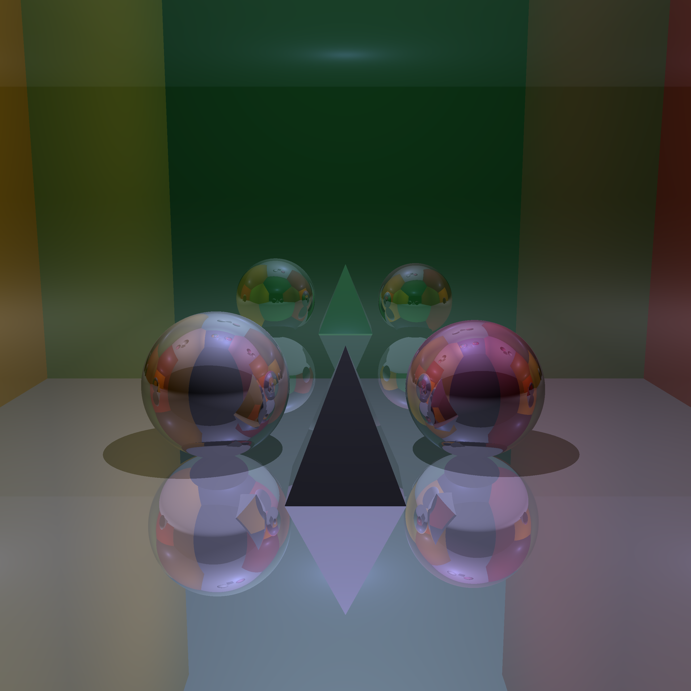
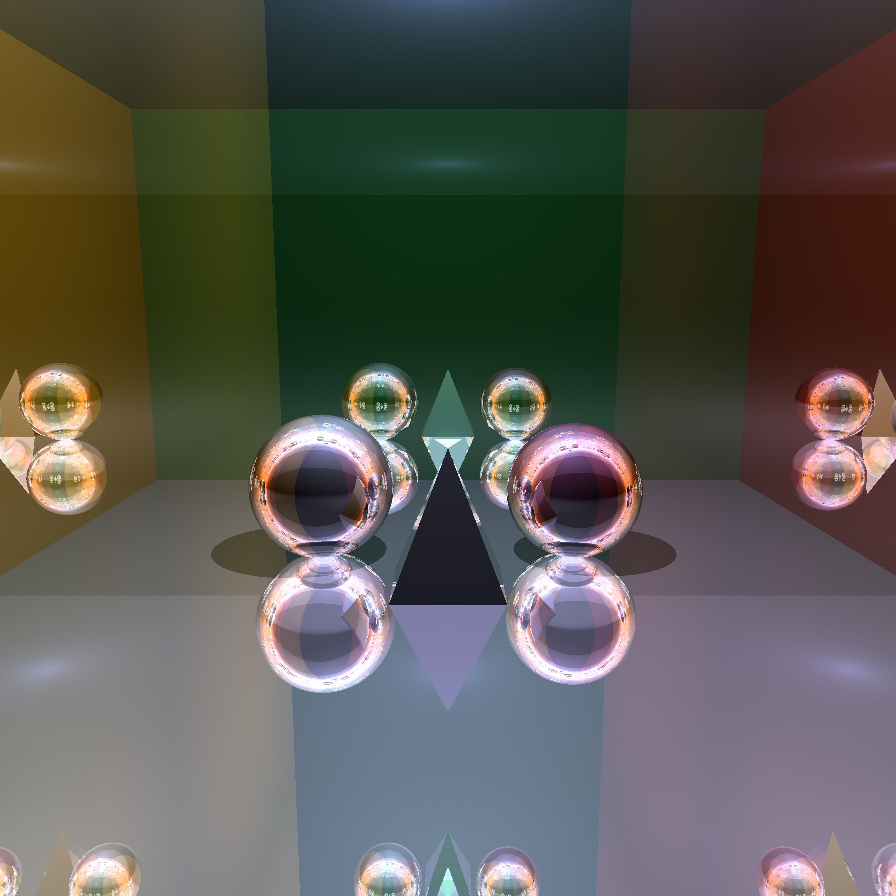

# PPS (Portable Path System) - CPU Ray Tracer

**A deterministic, software-defined rendering engine built from scratch in C++.**

PPS is a study in light transport, memory management, and low-level graphics programming. Unlike modern renderers that rely on GPU APIs (OpenGL, Vulkan, DirectX), PPS performs all calculations—intersection testing, color accumulation, and sampling—directly on the CPU.

## 🖼️ Render Gallery

*Cornell Box Scene - Depth 20*


*Cornell Box Scene Depth 13 fov 60*


## 🚀 Features

* **Pure Software Rendering:** No GPU acceleration. All logic runs on the processor.
* **Path Tracing:** Implements Monte Carlo integration for global illumination.
* **SDF (Signed Distance Fields):** Uses mathematical primitives for precise geometry definition.
* **Material Support:** * Dielectric (Glass/Water)
    * Lambertian (Matte)
    * Metallic (Reflection)
* **Dependencies:** Minimal bloat. Uses `SDL2` for windowing and `stb_image` for writing output.

## 🛠️ Technical Stack

* **Language:** C++ (Standard 17/20)
* **Windowing:** SDL2
* **Image Output:** stb_image_write
* **Architecture:** Single-threaded (Deterministic focus)

## 📖 The Story

I built this engine to understand the math behind computer graphics. It was developed largely in resource-constrained environments, forcing a focus on efficient memory usage and algorithmic correctness over raw brute force.

## 🏃 How to Run

1.  **Clone the repo:**
    ```bash
    git clone [https://github.com/ayndlr/PPS_STABLE_V0.git](https://github.com/ayndlr/PPS_STABLE_V0.git)
    ```
2.  **Build:**
    (Include your compilation instructions here, e.g., using g++ or make)
    ```bash
    g++ -o pps src/main.cpp -lSDL2
    ```
3.  **Run:**
    ```bash
    ./pps
    ```

## 📜 License

MIT License. Free to use for educational purposes.
